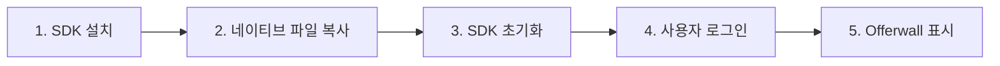

# AdChain SDK React Native 파트너 샘플

> 🚀 **AdChain SDK를 React Native에 완벽하게 통합하는 샘플 앱입니다.**  
> 네이티브 Offerwall 뷰와 WebView-App 이벤트 브릿지를 통해 최적의 사용자 경험을 제공합니다.

[](https://github.com/1selfworld-labs/adchain-sdk-android)
[](https://github.com/1selfworld-labs/adchain-sdk-ios-release)
[](https://reactnative.dev/)

## 📑 목차

- [🎯 프로젝트 개요](#-프로젝트-개요)
- [🚀 빠른 시작](#-빠른-시작)
- [🎓 시작하기 전에](#-시작하기-전에)
  - [필수 준비사항](#필수-준비사항)
  - [필수 개념 이해하기](#필수-개념-이해하기)
- [📦 SDK 연동 가이드](#-sdk-연동-가이드)
  - [1단계: SDK 설치](#1단계-sdk-설치)
  - [2단계: Android 네이티브 코드 설정](#2단계-android-네이티브-코드-설정)
  - [3단계: iOS 네이티브 코드 설정](#3단계-ios-네이티브-코드-설정)
  - [4단계: React Native 연동](#4단계-react-native-연동)
- [💻 SDK 사용법](#-sdk-사용법)
- [🎨 네이티브 Offerwall](#-네이티브-offerwall)
- [🔔 이벤트 브릿지](#-이벤트-브릿지)
- [📚 API 레퍼런스](#-api-레퍼런스)
- [🆘 문제 해결](#-문제-해결)

---

## 🎯 프로젝트 개요

AdChain SDK를 React Native에 완벽하게 통합하는 **파트너 샘플 앱**입니다.  
WebView 대신 **네이티브 Offerwall 뷰**를 사용하여 최적의 성능과 사용자 경험을 제공합니다.

### ✨ 핵심 특징

- 🚀 **네이티브 Offerwall**: 고성능 네이티브 UI 컴포넌트
- 🔄 **양방향 이벤트 브릿지**: WebView ↔ React Native 실시간 통신
- 📱 **완전한 SDK 통합**: Quiz, Mission, Banner 모든 기능 포함
- 🔒 **자동 로그인 관리**: 사용자 친화적 인증 플로우
- 📝 **TypeScript 지원**: 타입 안전성과 개발 효율성

### 🛠 기술 스택

| 항목         | 버전    | 비고                |
| ------------ | ------- | ------------------- |
| React Native | 0.79.2  | Legacy Architecture |
| Android SDK  | v1.0.25 | API 21+             |
| iOS SDK      | v1.0.41 | iOS 16.0+           |

---

## 🚀 빠른 시작

### 1️⃣ 프로젝트 실행

```bash
# 의존성 설치
npm install

# iOS Pod 설치
cd ios && pod install && cd ..

# 앱 실행
npm run android  # 또는 npm run ios
```

### 2️⃣ 샘플 앱 체험

1. **홈 화면** → "Adchain 로그인" 버튼 클릭
2. **혜택 탭** → 네이티브 Offerwall 뷰 확인
3. **SDK 테스트하기** → 모든 기능 테스트

---

## 🎓 시작하기 전에

### 필수 준비사항

AdChain SDK를 연동하기 전에 다음 정보를 준비해야 합니다:

#### 1. SDK 인증 정보 발급 받기

AdChain 담당자에게 연락하여 다음 정보를 발급받으세요:

| 항목 | 설명 | 예시 |
|------|------|------|
| **APP_KEY** (Android) | Android 앱용 고유 키 | `123456783` |
| **APP_SECRET** (Android) | Android 앱용 시크릿 키 | `abcdefghigjk` |
| **APP_KEY** (iOS) | iOS 앱용 고유 키 | `123456784` |
| **APP_SECRET** (iOS) | iOS 앱용 시크릿 키 | `abcdefghigjk` |

> 📧 **문의**: AdChain 담당자 이메일 또는 1Self World 파트너 포털

#### 2. placementId란?

**placementId**는 Offerwall이 표시되는 위치를 추적하기 위한 식별자입니다.

**사용 예시**:
```typescript
<AdchainOfferwallView placementId="main_tab_offerwall" />
<AdchainOfferwallView placementId="event_popup_offerwall" />
<AdchainOfferwallView placementId="benefit_screen" />
```

**명명 규칙** (권장):
- `main_tab_*`: 메인 탭에서 표시
- `event_*`: 이벤트 화면에서 표시
- `popup_*`: 팝업으로 표시
- 소문자와 언더스코어(_) 사용 권장

**용도**:
- 분석 및 통계 수집
- A/B 테스트
- 위치별 성과 측정

> 💡 **팁**: placementId는 자유롭게 정의할 수 있지만, 의미 있는 이름을 사용하여 나중에 분석 시 쉽게 구분할 수 있도록 하세요.

### 필수 개념 이해하기

#### React Native Bridge 파일

이 샘플 앱은 **React Native Bridge**를 사용하여 네이티브 SDK와 연동합니다:

| 파일명 | 플랫폼 | 역할 |
|--------|--------|------|
| `AdchainSdkModule.kt` | Android | SDK 메서드를 React Native에 노출 (로그인, Quiz, Mission 등) |
| `AdchainSdkPackage.kt` | Android | 모듈을 React Native에 등록 |
| `AdchainOfferwallViewManager.kt` | Android | 네이티브 Offerwall View 컴포넌트 |
| `AdchainSdk.swift` | iOS | SDK 메서드를 React Native에 노출 |
| `AdchainSdk.m` | iOS | Swift-Objective-C 브릿지 헤더 |
| `AdchainOfferwallViewManager.swift` | iOS | 네이티브 Offerwall View 컴포넌트 |
| `AdchainOfferwallViewManager.m` | iOS | Swift-Objective-C 브릿지 헤더 |

이 파일들은 **그대로 복사**하여 사용하면 됩니다. 수정할 필요 없음!

#### SDK 연동 흐름



1. **SDK 설치**: Gradle/CocoaPods를 통한 SDK 라이브러리 추가
2. **네이티브 파일 복사**: React Native Bridge 파일 복사 및 등록
3. **SDK 초기화**: `AdchainSdk.initialize()` 호출 (앱 시작 시 1회)
4. **사용자 로그인**: `AdchainSdk.login()` 호출 (사용자별 1회)
5. **Offerwall 표시**: `<AdchainOfferwallView>` 컴포넌트 사용

---

## 📦 SDK 연동 가이드

### 1단계: SDK 설치

#### Android SDK 설치

**파일**: `android/app/build.gradle` (⚠️ `android/build.gradle`이 아님!)

```gradle
dependencies {
    // The version of react-native is set by the React Native Gradle Plugin
    implementation("com.facebook.react:react-android")

    // ... 기존 dependencies ...

    // ===== AdChain SDK 추가 시작 =====

    // AdChain SDK - 핵심 라이브러리
    implementation 'com.github.1selfworld-labs:adchain-sdk-android:v1.0.25'

    // Kotlin 관련 의존성
    implementation "org.jetbrains.kotlin:kotlin-stdlib:1.9.21"
    implementation "org.jetbrains.kotlinx:kotlinx-coroutines-android:1.7.3"

    // Retrofit & Network (HTTP 통신)
    implementation "com.squareup.retrofit2:retrofit:2.9.0"
    implementation "com.squareup.retrofit2:converter-gson:2.9.0"
    implementation "com.squareup.retrofit2:converter-moshi:2.9.0"
    implementation "com.squareup.moshi:moshi:1.15.0"
    implementation "com.squareup.moshi:moshi-kotlin:1.15.0"
    implementation "com.google.code.gson:gson:2.10.1"
    implementation "com.squareup.okhttp3:okhttp:4.12.0"
    implementation "com.squareup.okhttp3:logging-interceptor:4.12.0"

    // AndroidX (Android 호환성)
    implementation 'androidx.core:core:1.10.1'
    implementation 'androidx.core:core-ktx:1.10.1'

    // Google Play Services (광고 ID 조회)
    implementation 'com.google.android.gms:play-services-ads-identifier:18.0.1'

    // ===== AdChain SDK 추가 끝 =====
}
```

💡 **추가 설정**: `android/build.gradle` (프로젝트 루트)에 Maven 저장소 추가 필요

```gradle
allprojects {
    repositories {
        // ... 기존 repositories ...
        maven { url 'https://jitpack.io' }  // AdChain SDK용 저장소
    }
}
```

#### iOS SDK 설치

`ios/Podfile`에 설정 추가:

```ruby
use_frameworks! :linkage => :static
platform :ios, '16.0'

target 'YourAppName' do
  use_react_native!(
    :path => config[:reactNativePath],
    :app_path => "#{Pod::Config.instance.installation_root}/..",
    :hermes_enabled => true,
    :fabric_enabled => false,
    :new_arch_enabled => false
  )

  # AdChain SDK 추가
  pod 'AdChainSDK', :git => 'https://github.com/1selfworld-labs/adchain-sdk-ios-release.git', :tag => 'v1.0.41'
end
```

```bash
cd ios && pod install && cd ..
```

### 2단계: Android 네이티브 코드 설정

#### 필수 파일 복사

샘플 프로젝트에서 다음 파일들을 **그대로** 복사하여 귀사 프로젝트에 붙여넣기:

```bash
# 복사할 파일 위치
샘플/android/app/src/main/java/com/adchainsdkpartnersample/
├── AdchainSdkModule.kt              # SDK 기능 브릿지 (로그인, Quiz, Mission 등)
├── AdchainSdkPackage.kt             # 패키지 등록용
└── AdchainOfferwallViewManager.kt   # Offerwall 네이티브 뷰 컴포넌트

# 붙여넣을 위치 (귀사 프로젝트)
android/app/src/main/java/com/yourcompany/yourapp/
├── AdchainSdkModule.kt
├── AdchainSdkPackage.kt
└── AdchainOfferwallViewManager.kt
```

#### 패키지명 변경

복사한 **3개 파일 모두**의 첫 번째 줄 패키지명을 변경:

```kotlin
// ❌ 변경 전 (샘플 앱 패키지명)
package com.adchainsdkpartnersample

// ✅ 변경 후 (귀사 앱 패키지명으로 수정)
package com.yourcompany.yourapp
```

💡 **패키지명 확인 방법**: `android/app/src/main/AndroidManifest.xml`의 `package` 속성 참조

#### MainApplication 수정

**파일**: `android/app/src/main/java/com/yourcompany/yourapp/MainApplication.kt`

1. **import 추가** (파일 상단):
```kotlin
import com.yourcompany.yourapp.AdchainSdkPackage  // 추가
```

2. **getPackages() 메서드 수정**:
```kotlin
class MainApplication : Application(), ReactApplication {
  override val reactNativeHost: ReactNativeHost =
    object : DefaultReactNativeHost(this) {
      override fun getPackages(): List<ReactPackage> =
        PackageList(this).packages.apply {
          // 이 한 줄을 추가
          add(AdchainSdkPackage())
        }
    }
}
```

⚠️ **주의**:
- `add(AdchainSdkPackage())`는 **단 한 번만** 추가해야 합니다
- 중복 추가 시 "tried to override" 에러 발생

### 3단계: iOS 네이티브 코드 설정

#### 필수 파일 복사

샘플 프로젝트에서 다음 파일들을 **그대로** 복사:

```bash
# 복사할 파일 위치
샘플/ios/AdchainSdkPartnerSample/
├── AdchainSdk.swift                      # SDK 기능 브릿지 (로그인, Quiz, Mission 등)
├── AdchainSdk.m                          # Objective-C 브릿지 헤더
├── AdchainOfferwallViewManager.swift     # Offerwall 네이티브 뷰 컴포넌트
└── AdchainOfferwallViewManager.m        # Objective-C 브릿지 헤더

# 붙여넣을 위치 (귀사 프로젝트)
ios/YourAppName/
├── AdchainSdk.swift
├── AdchainSdk.m
├── AdchainOfferwallViewManager.swift
└── AdchainOfferwallViewManager.m
```

#### Xcode에서 파일 추가

1. **Xcode 실행**: `ios/YourApp.xcworkspace` 파일 더블클릭 (⚠️ `.xcodeproj`가 아님!)
2. **파일 추가**:
   - 좌측 프로젝트 네비게이터에서 프로젝트 폴더 (YourAppName) 우클릭
   - "Add Files to 'YourAppName'..." 선택
3. **설정 확인**:
   - ✅ **"Copy items if needed"** 반드시 체크
   - ✅ **"Create groups"** 선택
   - ✅ 메인 앱 타겟 (YourAppName) 체크
   - 복사한 4개 파일 모두 선택
4. **"Add" 클릭**

#### Bridging Header 설정

Swift와 Objective-C를 연결하는 Bridging Header가 필요합니다.

##### 자동 생성 (권장)

파일 추가 시 "Would you like to configure an Objective-C bridging header?" 팝업이 나타나면:
- ✅ **"Create Bridging Header"** 클릭

##### 수동 생성 (팝업이 나타나지 않은 경우)

1. **Bridging Header 파일 생성**:
   ```bash
   # 프로젝트 루트에서 실행
   touch ios/YourAppName/YourAppName-Bridging-Header.h
   ```

2. **Bridging Header 내용 작성**:
   ```objective-c
   //
   //  Use this file to import your target's public headers that you would like to expose to Swift.
   //

   #import <React/RCTBridgeModule.h>
   #import <React/RCTViewManager.h>
   #import <React/RCTEventEmitter.h>
   ```

3. **Xcode에서 Bridging Header 경로 설정**:
   - Xcode에서 프로젝트 선택 (좌측 최상단)
   - TARGETS → YourAppName 선택
   - "Build Settings" 탭
   - "Swift Compiler - General" 섹션 찾기
   - "Objective-C Bridging Header" 항목에 다음 입력:
     ```
     YourAppName/YourAppName-Bridging-Header.h
     ```

4. **Xcode 프로젝트에 파일 추가**:
   - 프로젝트 네비게이터에서 프로젝트 폴더 우클릭
   - "Add Files to 'YourAppName'..."
   - 생성한 `YourAppName-Bridging-Header.h` 파일 선택
   - ✅ "Copy items if needed" 체크
   - "Add" 클릭

#### 빌드 확인

```bash
cd ios
pod install
cd ..
npx react-native run-ios
```

⚠️ **문제 해결**:
- `Use of undeclared identifier 'AdchainSdk'` 에러 발생 시:
  - Bridging Header 경로가 올바른지 확인
  - Xcode에서 Product → Clean Build Folder 후 재빌드
- Swift 파일이 Target Membership에 포함되어 있는지 확인:
  - Swift 파일 선택 → 우측 패널 → Target Membership → 메인 타겟 체크

### 4단계: React Native 연동

#### SDK 초기화

`src/App.tsx`에서 SDK 초기화:

```typescript
import React, { useEffect, useState } from 'react';
import { ActivityIndicator, Platform, SafeAreaView, Text } from 'react-native';
import AdchainSdk from './services/AdchainSdk';

// SDK 환경 설정
const SDK_CONFIG = {
  android: {
    APP_KEY: 'YOUR_ANDROID_APP_KEY',    // AdChain 관리자에게 발급받은 Android Key
    APP_SECRET: 'YOUR_ANDROID_SECRET',  // AdChain 관리자에게 발급받은 Android Secret
  },
  ios: {
    APP_KEY: 'YOUR_IOS_APP_KEY',        // AdChain 관리자에게 발급받은 iOS Key
    APP_SECRET: 'YOUR_IOS_SECRET',      // AdChain 관리자에게 발급받은 iOS Secret
  },
};

function App(): React.JSX.Element {
  const [sdkInitialized, setSdkInitialized] = useState(false);

  useEffect(() => {
    // 앱 시작 후 약간의 지연을 두고 SDK 초기화
    const initTimeout = setTimeout(() => {
      initializeSDK();
    }, 500);

    return () => clearTimeout(initTimeout);
  }, []);

  const initializeSDK = async () => {
    try {
      // 플랫폼별 SDK 설정
      const sdkConfig = Platform.select({
        android: {
          appKey: SDK_CONFIG.android.APP_KEY,
          appSecret: SDK_CONFIG.android.APP_SECRET,
          environment: 'PRODUCTION' as const,
        },
        ios: {
          appKey: SDK_CONFIG.ios.APP_KEY,
          appSecret: SDK_CONFIG.ios.APP_SECRET,
          environment: 'PRODUCTION' as const,
        },
        default: {
          appKey: 'test-app',
          appSecret: 'test-secret',
          environment: 'DEVELOPMENT' as const,
        },
      });

      // SDK 초기화 (로그인은 별도로 사용자가 원하는 시점에 수행)
      await AdchainSdk.initialize(sdkConfig);
      console.log(`AdchainSDK initialized for ${Platform.OS}`);

      // SDK 초기화 완료를 위해 잠시 대기
      await new Promise((resolve) => setTimeout(resolve, 1000));
      setSdkInitialized(true);
    } catch (error) {
      console.error('AdchainSDK initialization error:', error);
      setSdkInitialized(true); // 에러가 발생해도 앱은 계속 실행
    }
  };

  // SDK 초기화 중 로딩 화면 표시
  if (!sdkInitialized) {
    return (
      <SafeAreaView>
        <ActivityIndicator size="large" color="#007AFF" />
        <Text>SDK 초기화 중...</Text>
      </SafeAreaView>
    );
  }

  return (
    // Your app components...
  );
}

export default App;
```

#### 사용자 로그인

SDK 초기화 후, 사용자가 로그인할 때 AdChain SDK에도 로그인해야 합니다:

```typescript
import AdchainSdk from './services/AdchainSdk';

// 사용자 로그인 화면이나 앱 시작 시
const loginToAdchain = async (userId: string) => {
  try {
    await AdchainSdk.login({
      userId: userId,           // 필수: 앱의 고유 사용자 ID
      gender: 'MALE',          // 선택: 'MALE' | 'FEMALE' | 'OTHER'
      birthYear: 1990,         // 선택: 출생년도 (YYYY)
    });
    console.log('AdChain 로그인 성공');
  } catch (error) {
    console.error('AdChain 로그인 실패:', error);
  }
};
```

⚠️ **중요**:
- SDK 초기화(`initialize`)와 로그인(`login`)은 별도 작업입니다
- 로그인하지 않으면 Offerwall이 "로그인이 필요합니다" 메시지를 표시합니다
- 사용자가 앱에서 로그아웃할 때 `AdchainSdk.logout()`도 호출해야 합니다

---

## 💻 SDK 사용법

### 🔐 사용자 인증

```typescript
import AdchainSdk from './src/services/AdchainSdk';

// 로그인
const loginUser = async () => {
  try {
    await AdchainSdk.login({
      userId: 'user123',
      gender: 'MALE', // 선택: 'MALE' | 'FEMALE' | 'OTHER'
      birthYear: 1990, // 선택: 출생년도
    });
    console.log('로그인 성공');
  } catch (error) {
    console.error('로그인 실패:', error);
  }
};

// 로그인 상태 확인
const isLoggedIn = await AdchainSdk.isLoggedIn();
const currentUser = await AdchainSdk.getCurrentUser();

// 로그아웃
await AdchainSdk.logout();
```

### 🎯 Quiz 기능

```typescript
// Quiz 목록 로드
const quizList = await AdchainSdk.loadQuizList('quiz-unit-id');

// Quiz 클릭
await AdchainSdk.clickQuiz('quiz-unit-id', 'quiz-id');
```

### 🎮 Mission 기능

```typescript
// Mission 목록 로드
const missions = await AdchainSdk.loadMissionList('mission-unit-id');

// Mission 클릭
await AdchainSdk.clickMission('mission-unit-id', 'mission-id');

// 리워드 수령
await AdchainSdk.claimReward('mission-unit-id');
```

### 📢 Banner 기능

```typescript
// 배너 정보 로드
const bannerInfo = await AdchainSdk.getBannerInfo('placement-id');
```

---

## 🎨 네이티브 Offerwall

### 기본 사용법

```typescript
import {AdchainOfferwallView} from './src/components/offerwall';

function BenefitScreen() {
  return (
    <AdchainOfferwallView
      placementId="main_tab_offerwall"
      style={{flex: 1}}
      onOfferwallOpened={() => console.log('Offerwall 열림')}
      onOfferwallClosed={() => console.log('Offerwall 닫힘')}
      onOfferwallError={error => console.error('오류:', error)}
      onRewardEarned={amount => console.log('리워드 획득:', amount)}
    />
  );
}
```

### Props

| Prop                | 타입                       | 설명                     | 필수 |
| ------------------- | -------------------------- | ------------------------ | ---- |
| `placementId`       | `string`                   | 배치 ID (추적 및 분석용) | ✅   |
| `style`             | `ViewStyle`                | 뷰 스타일                | ❌   |
| `onOfferwallOpened` | `() => void`               | Offerwall이 열렸을 때    | ❌   |
| `onOfferwallClosed` | `() => void`               | Offerwall이 닫혔을 때    | ❌   |
| `onOfferwallError`  | `(error: string) => void`  | 오류 발생 시             | ❌   |
| `onRewardEarned`    | `(amount: number) => void` | 리워드 획득 시           | ❌   |

### 로그인 상태 관리

Offerwall 컴포넌트는 자동으로 로그인 상태를 확인하고, 로그인이 되지 않은 경우 사용자 친화적인 메시지를 표시합니다.

---

## 🔔 이벤트 브릿지

### 개요

WebView와 React Native 앱 간의 **양방향 통신**을 통해 실시간 이벤트 전달과 데이터 요청이 가능합니다.

> ✅ **현재 상태**: Android v1.0.25, iOS v1.0.41에서 완전히 지원됨
> 🎯 **주요 기능**: 기본 이벤트, 커스텀 이벤트, 데이터 요청/응답 모두 사용 가능

### 지원 기능

#### 1. 기본 이벤트 처리

Offerwall의 생명주기와 리워드 획득을 추적할 수 있습니다.

```typescript
<AdchainOfferwallView
  placementId="main_offerwall"
  onOfferwallOpened={() => console.log('Offerwall 열림')}
  onOfferwallClosed={() => console.log('Offerwall 닫힘')}
  onOfferwallError={error => console.error('오류:', error)}
  onRewardEarned={amount => console.log('리워드 획득:', amount)}
/>
```

#### 2. 커스텀 이벤트 ✨ NEW

WebView에서 앱으로 커스텀 이벤트를 전송할 수 있습니다.

```typescript
<AdchainOfferwallView
  placementId="main_offerwall"
  onCustomEvent={(eventType, payload) => {
    // WebView에서 전송한 이벤트 처리
    if (eventType === 'show_toast') {
      Alert.alert('메시지', payload.message);
    } else if (eventType === 'navigate') {
      navigation.navigate(payload.screen);
    }
  }}
/>
```

**WebView에서 이벤트 전송 방법 (AdChain 관리자가 설정)**:
```javascript
// WebView 내부에서 실행
window.ReactNativeWebView.postMessage(JSON.stringify({
  type: 'custom_event',
  eventType: 'show_toast',
  payload: { message: '안녕하세요!' }
}));
```

#### 3. 데이터 요청/응답 ✨ NEW

WebView에서 앱의 데이터를 요청하고 응답받을 수 있습니다.

```typescript
<AdchainOfferwallView
  placementId="main_offerwall"
  onDataRequest={(requestType, params) => {
    // WebView가 요청한 데이터 타입에 따라 응답
    const responses = {
      user_points: {points: userPoints, currency: 'KRW'},
      user_profile: {userId: currentUser.id, nickname: currentUser.name},
      app_version: {version: '1.0.0', buildNumber: 100},
    };

    return responses[requestType] || null;
  }}
/>
```

**WebView에서 데이터 요청 방법 (AdChain 관리자가 설정)**:
```javascript
// WebView 내부에서 실행
window.ReactNativeWebView.postMessage(JSON.stringify({
  type: 'data_request',
  requestId: 'unique-request-id-123',
  requestType: 'user_points',
  params: {}
}));
```

### 실제 사용 예시

#### 포인트 잔액 표시 예제

```typescript
function BenefitScreen() {
  const [userPoints, setUserPoints] = useState(12345);

  return (
    <AdchainOfferwallView
      placementId="benefit_tab"
      onDataRequest={(requestType, params) => {
        if (requestType === 'user_points') {
          // 앱의 실제 포인트 정보 반환
          return {
            points: userPoints,
            currency: 'KRW',
            lastUpdated: new Date().toISOString()
          };
        }
        return null;
      }}
      onCustomEvent={(eventType, payload) => {
        if (eventType === 'points_updated') {
          // WebView에서 포인트가 변경되었음을 알림
          setUserPoints(payload.newPoints);
          Alert.alert('포인트 획득!', `${payload.earnedPoints}P를 획득했습니다!`);
        }
      }}
      onRewardEarned={(amount) => {
        // 기본 리워드 이벤트
        console.log(`${amount}P 획득`);
      }}
    />
  );
}
```

### 이벤트 브릿지 아키텍처

```
┌─────────────────┐           ┌─────────────────┐
│   React Native  │           │     WebView     │
│      App        │           │   (Offerwall)   │
└────────┬────────┘           └────────┬────────┘
         │                             │
         │  onCustomEvent ◄────────────┤ postMessage
         │  onDataRequest ◄────────────┤ postMessage
         │                             │
         │  리워드 획득 이벤트          │
         │  ◄──────────────────────────┤
         │                             │
         │  데이터 응답 ────────────────►
         └─────────────────────────────┘
```

### 주의사항

⚠️ **이벤트 브릿지 사용 시 고려사항**:

1. **성능**: 데이터 요청은 동기적으로 처리되므로 무거운 작업은 피해야 합니다
2. **타임아웃**: 데이터 요청은 5초 타임아웃이 있습니다
3. **권한**: WebView에서 요청하는 민감한 데이터는 검증 후 제공해야 합니다
4. **에러 처리**: 데이터를 제공할 수 없는 경우 `null` 또는 `undefined`를 반환하세요

---

---

## 📚 API 레퍼런스

### 초기화 및 인증

| 메서드             | 파라미터                                        | 반환값                     | 설명             |
| ------------------ | ----------------------------------------------- | -------------------------- | ---------------- |
| `initialize()`     | `{ appKey, appSecret, environment?, timeout? }` | `Promise<SuccessResponse>` | SDK 초기화       |
| `login()`          | `{ userId, gender?, birthYear? }`               | `Promise<SuccessResponse>` | 사용자 로그인    |
| `logout()`         | -                                               | `Promise<SuccessResponse>` | 로그아웃         |
| `isLoggedIn()`     | -                                               | `Promise<boolean>`         | 로그인 상태 확인 |
| `getCurrentUser()` | -                                               | `Promise<User \| null>`    | 현재 사용자 정보 |

### 퀴즈 및 미션

| 메서드              | 파라미터                            | 반환값                     | 설명              |
| ------------------- | ----------------------------------- | -------------------------- | ----------------- |
| `loadQuizList()`    | `unitId: string`                    | `Promise<QuizResponse>`    | Quiz 목록 로드    |
| `clickQuiz()`       | `unitId: string, quizId: string`    | `Promise<SuccessResponse>` | Quiz 클릭         |
| `loadMissionList()` | `unitId: string`                    | `Promise<MissionResponse>` | Mission 목록 로드 |
| `clickMission()`    | `unitId: string, missionId: string` | `Promise<SuccessResponse>` | Mission 클릭      |
| `claimReward()`     | `unitId: string`                    | `Promise<any>`             | 리워드 수령       |

### 광고 및 오퍼월

| 메서드                   | 파라미터                            | 반환값                     | 설명                 |
| ------------------------ | ----------------------------------- | -------------------------- | -------------------- |
| `openOfferwall()`        | `placementId?: string`              | `Promise<SuccessResponse>` | Offerwall 열기       |
| `openOfferwallWithUrl()` | `url: string, placementId?: string` | `Promise<SuccessResponse>` | URL로 Offerwall 열기 |
| `getBannerInfo()`        | `placementId: string`               | `Promise<BannerInfo>`      | 배너 정보 로드       |
| `openExternalBrowser()`  | `url: string`                       | `Promise<SuccessResponse>` | 외부 브라우저 열기   |

---

## 🆘 문제 해결

### 자주 발생하는 문제

#### Q: iOS 빌드 실패

```bash
cd ios
rm -rf Pods Podfile.lock
rm -rf ~/Library/Developer/Xcode/DerivedData/AdchainSdkPartnerSample-*
pod install
cd ..
npx react-native run-ios
```

#### Q: Android에서 "Native module AdchainSdk tried to override..." 에러

**원인:** MainApplication에서 AdchainSdkPackage()가 중복 추가됨  
**해결책:** `MainApplication.kt`에서 `add(AdchainSdkPackage())` 한 줄만 있는지 확인

#### Q: TypeScript에서 AdchainSdk를 찾을 수 없음

```bash
# Metro 재시작
npx react-native start --reset-cache

# 앱 재빌드
npx react-native run-android  # 또는 run-ios
```

#### Q: "Module AdchainSdk is not available" 에러

**해결책:** Native 코드 수정 후 전체 재빌드 필요

```bash
# Android
cd android && ./gradlew clean && cd ..
npx react-native run-android

# iOS
cd ios && pod install && cd ..
npx react-native run-ios
```

#### Q: Offerwall 화면이 로그인 메시지만 표시됨

**원인:** SDK 로그인이 안 됨  
**해결책:**

1. SDK 초기화 확인: `App.tsx`에서 `AdchainSdk.initialize()` 호출 확인
2. 로그인 확인: `AdchainSdk.login()` 호출 확인
3. 로그 확인: `await AdchainSdk.isLoggedIn()` 결과 확인

### 중요 설정

#### iOS 설정

- ✅ **use_frameworks 필수**: `Podfile`에 `use_frameworks! :linkage => :static` 설정
- ✅ **New Architecture 비활성화**: `:fabric_enabled => false, :new_arch_enabled => false`
- ✅ **최소 버전**: iOS 16.0 이상
- ✅ **Bridging Header**: Swift와 Objective-C 브릿지 설정 필수

#### Android 설정

- ✅ **Kotlin 버전**: 1.9.21 이상 권장
- ✅ **Coroutines**: kotlinx-coroutines-android 1.7.3 이상 필요
- ✅ **AndroidX 충돌**: `implementation 'androidx.core:core:1.10.1'` 추가로 해결

---

### 통합 중 문제 발생 시

1. **샘플 앱 실행**: 먼저 샘플 앱이 정상 동작하는지 확인
2. **파일 복사 확인**: 모든 필수 파일이 올바르게 복사되었는지 확인
3. **패키지명 확인**: Android/iOS 패키지명이 정확한지 확인
4. **로그 확인**: 네이티브 로그 (`Logcat`, `Xcode Console`) 확인

---

## 📝 변경 이력

| 날짜       | 버전  | 변경 내용                                                      |
| ---------- | ----- | -------------------------------------------------------------- |
| 2025-10-20 | 1.0.0 | 최초 릴리스 - 네이티브 Offerwall 뷰, 완전한 이벤트 브릿지 지원 (기본 이벤트, 커스텀 이벤트, 데이터 요청/응답 모두 포함) |
| 2025-10-20 | 1.0.1 | README 개선 - FACT 체크, 고객 관점 설명 강화, "시작하기 전에" 섹션 추가 |

**Version**: 1.0.1
**Last Updated**: 2025-10-20
**React Native**: 0.79.2
**Android SDK**: v1.0.25
**iOS SDK**: v1.0.41

---

## 💬 지원 및 문의

### 기술 지원

- 📧 **이메일**: [AdChain 기술지원 이메일]
- 📖 **공식 문서**: [AdChain SDK 문서]
- 🐛 **이슈 리포트**: GitHub Issues

### 파트너 문의

AdChain SDK 연동에 관심이 있으시거나 APP_KEY/APP_SECRET 발급이 필요하신 경우, 1Self World 파트너 담당자에게 문의해주세요.

---

**🎉 AdChain SDK를 선택해 주셔서 감사합니다!**

이 샘플 앱이 React Native 프로젝트에 AdChain SDK를 성공적으로 연동하는 데 도움이 되기를 바랍니다.
